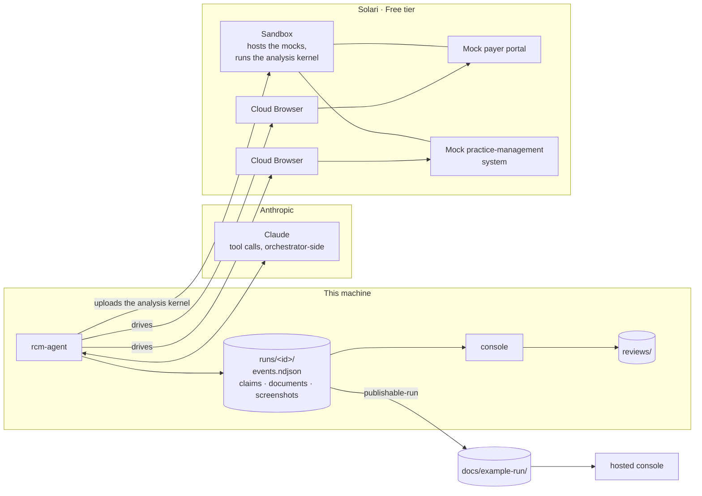

# Autonomous Healthcare RCM Denial Recovery Agent

An agent that recovers denied medical claims by operating payer and
practice-management software directly — no APIs required. Built on Solari's
Cloud Browser and Sandbox primitives.

## Look at it without running anything

One run's artifacts are committed, and the console opens them with the same code
that opens a live one. No credentials and nothing to provision:

```bash
git clone https://github.com/Agbobli5373/Autonomous-Healthcare-RCM-Denial-Recovery-Agent
cd Autonomous-Healthcare-RCM-Denial-Recovery-Agent
uv sync
uv run rcm-agent console --runs-dir docs/example-run
```

Three refusals of three different kinds, each needing a different answer — which
is the argument, because an agent that appealed all three would be wrong twice:

| Claim | What the payer said | Action |
| --- | --- | --- |
| `CLM-2026-0001` | `CO-197` + `N706` — no prior authorization on file | **appeal** |
| `CLM-2026-0002` | `CO-16` + `MA130` — **Unprocessable**: looks like a Denial and carries no appeal rights | **close**, by a Guardrail |
| `CLM-2026-0003` | `OA-22` + `MA04` — another payer is primary | **rebill** |

The middle one is the trap. `CONTEXT.md` names it: an Unprocessable claim *looks*
like a Denial, so an agent optimising for appeals files one that cannot be heard.
Here a Guardrail fixes the Action before any model is asked — the inspector shows
which rules ran and that no model was consulted at all.

Open a Claim and the inspector shows how each Determination was reached: which
Guardrails ran, what the model was offered and what was withheld from it, the
facts it was given and what came back.

Record a Verdict on one and the digest shown beside it is over the exact bytes of
the committed file, so it can be checked:

```bash
sha256sum docs/example-run/*/claims/clm-2026-0003.json   # shasum -a 256 on macOS
Get-FileHash docs\example-run\*\claims\clm-2026-0003.json -Algorithm SHA256   # PowerShell
```

**What this run does not contain.** It is `determine-all` output: extraction and
analysis. There is no payer portal, no practice-management system, no browser
work and no session recovery in it, so the inspector's browser-work panel says so
rather than showing captures. The two-browser leg is what `rcm-agent browse`
does, and putting it end to end with this is [#38](https://github.com/Agbobli5373/Autonomous-Healthcare-RCM-Denial-Recovery-Agent/issues/38).
The run also carries one handled `error` at `seq 14`: the model's judgement named
no evidence for `appeal`, and the agent fell back to the catalogue's evidence
list rather than failing the Claim. It is in the log because that is what
happened.

## Running it for real

**Prerequisites**, both needed before the first command rather than discovered at
the first failure:

| | |
| --- | --- |
| Python | 3.12 or newer, and [`uv`](https://docs.astral.sh/uv/) |
| `SOLARI_API_KEY` | a Solari key, in a gitignored `.env` |
| `ANTHROPIC_API_KEY` | an Anthropic key, in the same file |

**Plan and remaining credit are visible only in the Solari console.** There is no
account or usage API, so nothing here can read your balance or warn you before a
run; check it there. Everything below fits the Free tier — one sandbox, three
browsers — and the demo uses one sandbox and two browsers at a time.

```bash
uv sync
cp .env.example .env      # then paste the two keys in
uv run rcm-agent determine-all
uv run rcm-agent console
```

`determine-all` extracts each committed EOB in a Solari sandbox — one of them is
a scan, so it goes through OCR — and reaches a Determination on every claim.
It writes a run directory as it goes, and `console` opens it.

The setup budget is fifteen minutes and `uv sync` is most of it, on a cold
cache. Past that, the committed run records its own timing: `run.json` says
`08:57:28` to `09:03:25`, so **five minutes and fifty-seven seconds** for three
Claims, nearly all of it waiting on the sandbox and the model. The console
answers in under three seconds.

`rcm-agent run` is **still a scripted event sequence**, not the agent: it
exercises the run directory and the progress panel. The end-to-end orchestration
that replaces it is [#38](https://github.com/Agbobli5373/Autonomous-Healthcare-RCM-Denial-Recovery-Agent/issues/38);
until then `determine-all` and `browse` are the two commands that do real work.

## How it fits together



**The Anthropic key never leaves this machine.** Every model call is
orchestrator-side; the sandbox serves the mocks and runs the analysis kernel, and
is reachable from the public internet for as long as a run lasts, so the `agent`
and `browser` packages are excluded from what is uploaded to it.

**Two browsers, one sandbox.** Browsers and sandboxes are separate concurrency
counters on the Free tier, so two of one and one of the other fits — confirmed by
running it, not by reading the pricing page.

## What is in the committed run, checked rather than assumed

`docs/example-run/` is published by `rcm-agent publishable-run`, which strips
credential-shaped strings from text and refuses to hand over a copy that still
carries one. That is the mechanism; these are the findings on **this** run:

- **No key, token, URL, email address or fingerprint** appears anywhere in its
  text — `events.ndjson`, the three `claims/*.json`, or `run.json`.
- **No person.** Every patient-bearing field in the run holds a synthetic code —
  `PAT-33947`, `PAT-40219`, `PAT-51884` — and no name appears anywhere. Cascade
  Health Plan is an invented Payer; that one is a statement about the fixtures
  rather than a check on the artifact.
- **Every document is a committed synthetic fixture**, byte for byte: each PDF
  hashes equal to its source under `data/fixtures/eobs/`. The redaction walks
  text and does not read binaries, so this is checked by identity rather than
  argued from the design, and `tests/test_hosted_console.py` keeps checking it.

## Where this departs from the original spec

Four of them, stated here rather than left to be found. Each is a decision with a
reason, and the reasons are recorded in full where they were made.

**FR-2 — a five-way Determination replaces recoverable / non-recoverable.**
A binary score cannot say *what to do next*, and most denial volume is correction
work rather than appeal work. The agent chooses exactly one of **appeal**,
**corrected claim**, **rebill**, **patient bill**, **close**, and a Guardrail can
fix that Action without reference to any score, because sometimes the law or the
contract leaves no judgement to exercise. [ADR-0002](./docs/adr/0002-determination-replaces-recoverability-score.md).

**FR-3 and Goal 2 — the Desktop primitive is out.** Not because it is missing
from the Free tier, but because it *shares the single sandbox concurrency slot*:
[the capability research](./docs/research/solari-platform-capabilities.md) found
that VMs and Desktops appear to count against the same limit, so a workflow
holding a Sandbox and a Desktop open together does not fit. This demo holds a
Sandbox for the whole run — it hosts both mocks — so a Desktop cannot sit beside
it, and the Free tier was chosen deliberately over the $20/mo Starter plan. The
demo therefore exercises **two of the three primitives**, and the
practice-management system is a web EMR in a browser session rather than a
desktop application. (The [build plan](https://github.com/Agbobli5373/Autonomous-Healthcare-RCM-Denial-Recovery-Agent/issues/1)
records this as "unavailable on the Free tier", which is the shorthand rather
than the finding.)

**FR-1 — no CAPTCHA solving and no bot-detection evasion.** Not attempted, and
not a gap in the implementation: **no payer portal permits automated access at
all** — see [the sandbox survey](./docs/research/payer-portal-sandboxes.md). That
is why the portal here is a mock rather than a real one, and it is the honest
shape of this problem rather than a shortcut around it. Ruled out on the
[build plan](https://github.com/Agbobli5373/Autonomous-Healthcare-RCM-Denial-Recovery-Agent/issues/1)
before charting began.

**Deliverables — a standalone repository rather than a fork of
`solari-cookbook`.** The work is a project with its own domain model, its own
[ADRs](./docs/adr/) and its own test suite; carrying that as a fork would have
obscured what is new.

## The two mock systems

The agent operates two unrelated systems, and both are mocks. Run them side by
side — they are deliberately nothing alike to look at, because in the demo video
they must not read as one thing.

```bash
uv run rcm-agent serve-portal
```

```bash
uv run rcm-agent serve-practice
```

### The payer portal

No payer portal permits automated access, and this project does not evade bot
detection, so the demo drives a mock.

It serves at <http://127.0.0.1:8080>; any user ID and password are accepted. The
markup deliberately carries no `data-testid`, no stable `id` and no ARIA — hooks
added by the mock's own author would prove nothing about operating software that
was never built to be automated. Four frictions are equally deliberate: the
worklist arrives by XHR, the claim the demo follows sits on page two, the EOB
opens in a new tab as a download, and the session expires once on a claim-detail
view so the agent has to sign in again.

### The practice-management system

Serves at <http://127.0.0.1:8081>. This is where the `CO-197` denial is refuted:
the patient's chart holds the Authorization the payer says was never on file,
with its number, its validity range and its covered HCPCS scope, beside the date
of service they have to be compared against.

No open-source EMR models US payer authorizations, so it is purpose-built rather
than an authorization stubbed into a spare field of something bigger. The agent
also writes a chart note back, which is why it cannot be static. Notes are held
in memory: they survive a reload, and a restart returns the system to a known
screen so a second take of the demo starts where the first did.

Sign-on accepts any credentials, but the demo does not type them. It restores a
saved Solari browser profile instead:

```bash
uv run rcm-agent practice-storage-state --url http://127.0.0.1:8081
```

That writes a Playwright `storageState` file, which is one of the documented
ways to create a Solari profile — so the second profile is reproducible from
this repository rather than from whoever last signed on by hand. It contains no
secret: the session id it carries is a constant in the source, and the system it
opens holds only synthetic records.

### Serving them from a Solari sandbox

The demo does not run the mocks on localhost. It uploads the working copy into a
sandbox, serves both there, and exposes each port with `preview_url` — no tunnel,
no PaaS, no deploy step:

```bash
uv run rcm-agent host-mocks
```

That prints a public URL for each mock and holds them up until you interrupt it.
It needs `SOLARI_API_KEY` in a gitignored `.env`.

**One sandbox does all three jobs** — both mocks and the analysis kernel, which
runs on a real EOB before the URLs are handed over. The Free tier allows one
concurrent sandbox and the agent visits the practice-management system while the
kernel is still needed, so this is forced by the plan rather than chosen.

If a run is killed rather than interrupted, its sandbox can keep the only slot
for far longer than the ten-minute TTL suggests, and the next run then fails at
`create`. See the `SANDBOX_TTL_MS` docstring for how to end an orphan.

The servers are health-checked *from inside the sandbox* before any URL is
handed out. A browser pointed at a port that has not finished binding fails in a
way that reads as a platform fault rather than as a race, and the recorded run
has to be unbroken.

The preview URL carries an access token in its query string. It is printed to
the terminal, because that is what you open — but the run directory records the
URL without it.

## The agent

```bash
uv run rcm-agent browse
```

Hosts the mocks in a sandbox, opens **two Solari cloud browsers**, and hands
**Claude Sonnet 5** six tools and one instruction: work this claim. There is no
navigation sequence in the code. The model chooses each tool and its arguments,
and decides when it is finished.

Four of the tools drive the payer portal — `log_in`, `search_claims`,
`open_claim`, `download_eob`. Two drive the practice-management system in a
*second* browser session, authenticated from a saved profile:
`read_auth_record` and `write_note`.

**That second system is the point of the whole demo.** The payer denied the
claim saying no prior authorization was on file. The agent leaves the portal,
opens an unrelated system, and finds the Authorization that proves otherwise —
then writes what it concluded onto the patient's chart, which is why that system
could not be a static page.

`read_auth_record` returns **typed fields**: the validity range as two dates, the
covered HCPCS codes as a list, and the claim's date of service. It does not
decide whether the Authorization covers the claim. That comparison is the one
piece of real reasoning in this leg, and it belongs to the agent — a tool
returning a `covers` boolean would move it into a `<=`.

Two browser sessions and one sandbox run at the same time. Browsers and
sandboxes are separate concurrency counters on the Free tier, so two of one and
one of the other fits; this was confirmed by running it, not by reading the
pricing page.

It needs `ANTHROPIC_API_KEY` alongside `SOLARI_API_KEY` in the gitignored `.env`.
**All model calls are orchestrator-side**: the key is read in this process and
never reaches the sandbox, which serves the mocks and runs the analysis kernel
and is reachable from the public internet for as long as the demo lasts. The
`agent` and `browser` packages are excluded from what gets uploaded there for the
same reason. Token usage is reported per run and recorded in `events.ndjson`.

Escalating a step to Opus 5 is a configuration change rather than a rewrite —
see `Escalation` in `src/rcm_agent/agent/model.py`, which names the reason a step
would be escalated, not just the model.

### The recovery

The portal signs the agent out on its first claim-detail view, on purpose. The
handling is deliberately split:

- **Detection is the tool's, and deterministic.** `open_claim` notices it landed
  on the login page and returns `session_expired`. No model is asked to infer
  that, because it is a fact about the page.
- **The decision is the agent's.** Given that outcome, the model chooses to call
  `log_in` again and resume. The loop records that choice as a `recovery` event;
  it does not cause it. A test drives the same portal with a model that answers
  the expiry by giving up, and no `recovery` is recorded — which is how we know
  the record reflects the agent rather than the harness.

`recovery` and `retry` are different kinds and render differently: a retry is a
click that missed and is styled quietly; a recovery is the agent changing its
plan and is styled as **handled**, never as an error. A run that visibly stumbles
and recovers is more convincing than one that never stumbles — but only if the
record says which happened.

**Perception is the accessibility tree, not screenshots.** For a page the a11y
tree carries more than pixels do — role, name, structure — at a fraction of the
cost, and it does not move when a stylesheet does. The portal authors no ARIA at
all, and the tree is still rich, because real HTML has implicit semantics: a
`<table>` is a table and an `<a>` is a link. Screenshots are still taken at each
decision point, but as audit artifacts, named for the `seq` of the event that
references them.

**Locators use text and structure only.** The login fields have no accessible
name — their labels are sibling table cells rather than `<label for>` — so they
are reached through the row that names them, which is how a person finds them
too.

**Failures split by kind.** Mechanical ones — an element a frame late, a click
that missed — are retried inside the tool, three attempts at 250ms then 500ms
under a wall-clock cap, and appear in `events.ndjson` with an attempt count
without ever reaching the caller. Semantic ones — the session expired, the claim
is not in this queue, the credentials were refused — come back as results.
Retrying those would just ask the same question again.

The session expiry is the one the demo turns on: the portal signs the agent out
on its first claim detail, `open_claim` returns `session_expired`, and the run
signs in again and carries on. The record calls that `recovery`, not `error`.

## The console

```bash
uv run rcm-agent console
```

A web UI over what a run recorded: the queue of claims, what the payer refused
beside what the agent determined, and an inspector showing how it got there.

**It follows a run in flight.** Start a run in another terminal with the console
open and the queue fills as the agent works - rows resolving, phases advancing,
nothing reloaded. The console reads `runs/` and nothing tells it a run has
started, so a run launched any way at all is equally visible; opening the
console halfway through replays from the first event and then follows, and a
dropped connection reconnects and resumes from where it got to.

**Its built bundle is committed, and that is deliberate.** A reviewer must be
able to run this demo in under fifteen minutes, and a JavaScript build step
lands inside that budget. So the toolchain under `console/` exists for
developing the page and for nobody else: `uv run` is the only command anyone
needs, and Node is not in the prerequisites. `node_modules/` is not committed;
the output it produces is.

The page asks the network for nothing. There is no webfont - the typography is
the operating system's own stack, which is what the reference this borrows from
actually renders despite shipping a font of its own. Both themes are defined,
including the unstamped default that most viewers are in, and motion stops when
a viewer has asked it to.

Working on the console itself needs Node:

```bash
cd console && npm install
npm run build      # writes src/rcm_agent/console/static, which is committed
npm run typecheck  # tsc --noEmit, strict
npm test           # vitest
```

A change under `console/src` is not finished until it has been rebuilt: the
build stamps the bundle with a digest of its inputs and `pytest` fails when the
committed bundle came from anything else.

### Publishing a run

```bash
uv run rcm-agent publishable-run runs/<run-id> --out docs/example-run
```

Copies a run with anything credential-shaped removed from its **text** — the key
fingerprint, and the access token in a preview URL — and refuses to hand over a
copy that still carries one, deleting it rather than returning it. The redaction
is a walk over everything a run recorded rather than a list of known fields, so
content added later cannot quietly bypass it.

It does not read images. A screenshot is published exactly as it was captured,
and the fixtures are synthetic precisely so that is safe.

The same artifact is what the repository commits and what a hosted console
serves, so there is one thing to inspect and one thing to trust.

The export refuses more than it copies. It will not publish a run that never
finished, one that still carries a credential-shaped string, or one whose
`claims/<id>.json` does not hash to the digest its recorded Determination
carries — because that digest is what a Review names, and publishing a number
beside an artifact it does not describe is the one thing an exported run must
not do.

### Hosting it

The hosted console is the same command a reviewer runs locally, pointed at the
committed export and a scratch disk:

```bash
uv run rcm-agent console --runs-dir docs/example-run --reviews-dir /tmp/reviews
```

That is what [`Dockerfile`](./Dockerfile) runs. One command rather than a hosted
mode, because a surface that exists only when deployed is a surface nobody
develops against.

**The instance is meant to sleep.** Its disk resets on wake, so the verdicts one
Reviewer records clear themselves and the next arrives at a clean queue. That is
why the volume has to be writable and not persistent, and why there is no "reset
demo" button — a control that existed only in the hosted build would be a small
lie to tell in a product surface.

**Nothing there can start a run.** No Solari and no model credentials are
deployed: the `Dockerfile` copies five named paths rather than the tree, and
`.env` is under none of them; `.dockerignore` is the second line rather than the
guarantee. `tests/test_hosted_console.py` enumerates the served routes rather
than promising anything about them.

**The cold start is designed rather than absorbed.** Waking takes about half a
minute, during which the instance serves nothing at all — so
[`docs/hosting/waking.html`](./docs/hosting/waking.html) is a single
self-contained file, hosted somewhere that does not sleep, which paints
immediately, says what the wait is for, polls `/healthz`, and forwards when the
console answers. Someone arriving from an application and meeting a blank tab
concludes the demo is broken.

## Where things are

| | |
| --- | --- |
| Domain glossary | [`CONTEXT.md`](./CONTEXT.md) |
| Architecture decisions | [`docs/adr/`](./docs/adr/) |
| Research behind the decisions | [`docs/research/`](./docs/research/) |
| The console's front end | [`console/`](./console/) (built output lives in `src/rcm_agent/console/static/`) |
| The run the hosted console serves | [`docs/example-run/`](./docs/example-run/) |
| Deployment | [`Dockerfile`](./Dockerfile), [`render.yaml`](./render.yaml), [`docs/hosting/`](./docs/hosting/) |
| The plan, as issues | [decision map](https://github.com/Agbobli5373/Autonomous-Healthcare-RCM-Denial-Recovery-Agent/issues/1) |

## Development

```bash
uv run ruff check .
uv run ruff format --check .
uv run pyright
uv run pytest
(cd console && npm run typecheck && npm test)
```

The last line needs Node and is only for changes to the console; everything
above it is all a reviewer ever runs.

The Solari smoke-test spike under `spikes/` needs its own extra:

```bash
uv sync --extra spike
```
